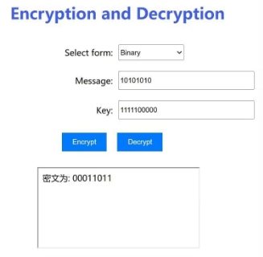

# SDES_CQU_InformationSecurity

This project is an implementation of the Simplified DES (S-DES) algorithm for encryption and decryption. It was created for the introductory course on Information Security at Chongqing University by the Hello world team (Zhang Shiqi & Wang Yubo).

## Introduction to the S-DES Algorithm

S-DES (Simplified Data Encryption Standard) is a symmetric key encryption algorithm designed for educational purposes. It's a simplified version of the standard DES algorithm. While it's not used in real-world applications, it offers a great way to understand how symmetric encryption algorithms work.

### Key Features:

1. **Fixed-length key**: Just like the standard DES algorithm, S-DES has a fixed-length key.
2. **Symmetric Encryption**: The process of encryption and decryption is symmetrical, utilizing the same key.
3. **Block Encryption**: The plaintext is divided into fixed-length blocks for encryption, each being encrypted separately.

### Encryption Process:

The encryption process of S-DES involves multiple steps including initial permutation, key generation, substitution-permutation operations, XOR operations, and final permutation.

1. **Initial Permutation (IP)**: The bits of the plaintext are rearranged in a specific order.
2. **Key Generation**: Two subkeys are derived from the original key.
3. **Substitution-Permutation (F function)**: This is the heart of S-DES encryption which includes expansion permutation, S-box substitution, and P-box permutation.
4. **XOR Operation**: Some parts of the plaintext block are XORed with subkeys.
5. **Final Permutation (FP)**: A final permutation is applied to the intermediate result to produce the ciphertext.

## Code Framework

### 1. SDES Class:

- Defines various permutation tables (`P10_TABLE`, `P8_TABLE`, etc.) and substitution boxes (`SBOX0`, `SBOX1`).
- Provides methods for:
  - Permutation (`permute()`)
  - Left shift (`ls()`)
  - Subkey generation (`subkey()`)
  - Core Fk function of S-DES (`function()`)
  - Encrypting an 8-bit block (`encrypt()`)
  - Decrypting an 8-bit block (`decrypt()`)
  - Encrypting ASCII strings (`encryptAsc()`)
  - Decrypting ASCII strings (`decryptAsc()`).

### 2. GUI Class:

- Creates a GUI window for S-DES.
- Allows users to input a key and plaintext (or ciphertext) and click buttons to encrypt or decrypt.
- Outputs are displayed within the window.
- Supports both binary input (8-bit blocks) and ASCII strings.

### 3. EncryptListener and DecryptListener Classes:

- Handle button clicks for encrypting and decrypting 8-bit blocks using the S-DES algorithm.
- Display errors if the input format is not correct.

## Test Results

### Level 1: Basic Test

### Level 2: Cross Test

Our team's test:

Other team's test:

The results match.

### Level 3: Extended Features

Plaintext and ciphertext use ASCII encoded strings grouped by 1 Byte.

### Level 4: Brute Force Attack

Decrypting a pair of plaintext and ciphertext:

Decrypting multiple pairs:

### Level 5: Closed Test

Based on the results of Level 4, for a randomly selected plaintext-ciphertext pair, there may be more than one key. For any given plaintext block Pn in the plaintext space, there may be a situation where different keys Ki≠Kj are encrypted to get the same ciphertext Cn. For instance, for the keys 1111000010 and 1011000010, the ciphertext for the plaintext 11100110 is 01110100 for both.

## Contribution

Contributions to this project are welcomed. Please fork the project and submit a pull request.

## Copyright and License

The code under this project is protected by [MIT License](LICENSE).

## License

MIT License

Copyright (c) 2023 Your Name

Permission is hereby granted, free of charge, to any person obtaining a copy
of this software and associated documentation files (the "Software"), to deal
in the Software without restriction, including without limitation the rights
to use, copy, modify, merge, publish, distribute,
